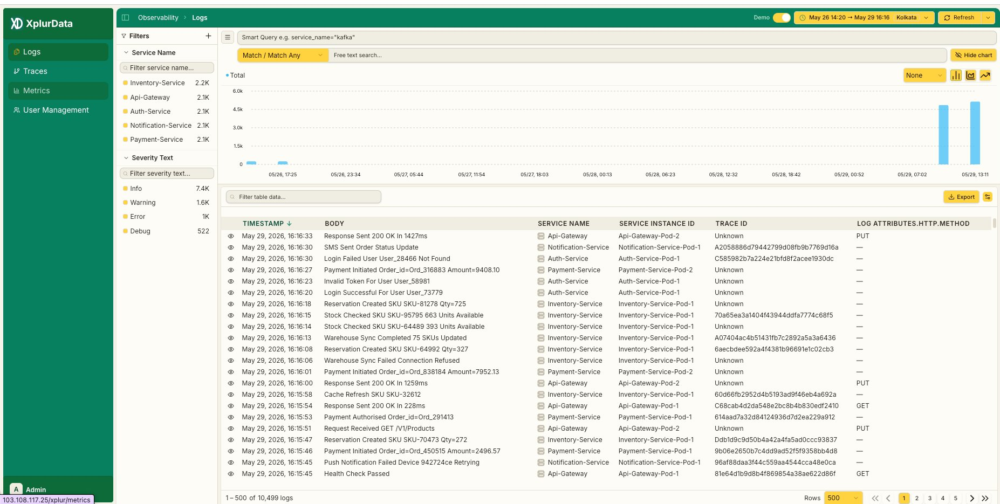

# Smart Logs Explorer

_Search, filter, and analyse your log data in real time._

The Smart Logs Explorer is XplurData's primary interface for querying and investigating log
data. It combines a powerful filter panel, a time-series volume chart, and a paginated log
table — all driven by the same underlying Doris columnar store. Every filter you apply
updates the chart and the table instantly, giving you a live feedback loop as you narrow
down an incident or pattern.

## Layout

The explorer is divided into three regions. The left panel hosts all filter controls —
Service Name and Severity filters with live counts. The top-right area shows an interactive
time-series chart of log volume. The bottom area is the log table, showing up to 500 rows
per page with full column visibility.

| Region | Location | Purpose |
| --- | --- | --- |
| Filter Panel | Left sidebar | Narrow results by service, severity, or any attribute |
| Active Filter Bar | Top bar below nav | Shows active filter tags and Smart Query input |
| Volume Chart | Top-right content area | Time-series log count — bar, line, or area view |
| Log Table | Bottom content area | Paginated list of matching log records |
| Time Range Picker | Top-right corner | Set the query window — relative or absolute |
| Refresh Control | Top-right corner | Manual or auto-refresh the entire view |

## Time range selection

The time range picker in the top-right corner controls the query window for both the chart
and the table. Click it to choose a relative range (last 15 minutes, last 1 hour, last 24
hours, etc.) or enter a custom absolute range. The current range is always visible — for
example, `May 26 14:20 → May 29 16:16`. A timezone selector lets you align timestamps to
your local zone or UTC.

:::info
All timestamps displayed in the log table and chart reflect the timezone you select in the
time range picker. Switch timezones at any time — the view updates without re-querying.
:::

## Filter panel

The filter panel on the left lets you drill into your logs by any indexed dimension. Each
filter group is collapsible. A search box at the top of each group lets you quickly find a
specific value when there are many options. Clicking a value applies it as an active filter;
the count badge next to each value shows how many log records match within the current time
window.

| Filter Group | Description | Example Values |
| --- | --- | --- |
| Service Name | The OTel `service.name` resource attribute. Lists every service that has emitted logs in the selected time range. | Inventory-Service, Api-Gateway, Payment-Service, Auth-Service, Notification-Service |
| Severity Text | The log severity level as reported by the emitting SDK. | Info, Warning, Error, Debug |

:::info
The count badge next to each filter value (e.g. 1.5K, 1.6K) reflects the number of log
records matching that value within the currently selected time range. Counts update whenever
the time range changes.
:::

## Active filter bar & Smart Query

Every filter you apply from the panel appears as a removable tag in the active filter bar —
for example, `severity_text="INFO"`. You can remove a tag by clicking the × on it, or clear
all filters at once with the Clear button. The Smart Query input next to the tags accepts
free-form query expressions for advanced filtering, letting you combine conditions without
leaving the search bar.

| Expression | What it matches |
| --- | --- |
| `severity_text="ERROR"` | All error-level logs |
| `service_name="Api-Gateway" AND severity_text="WARN"` | Warnings from the API Gateway only |
| `body LIKE "%timeout%"` | Any log whose body contains the word timeout |
| `trace_id IS NOT NULL` | Logs that carry a trace ID (i.e. are correlated with a trace) |
| `http_method="POST" AND severity_text="ERROR"` | POST requests that resulted in an error |

### Match / Match Any toggle

When multiple filters are active, the Match / Match Any toggle above the free-text search
controls how they are combined. **Match (AND)** requires a log record to satisfy every active
filter. **Match Any (OR)** returns records that satisfy at least one active filter. This
toggle also applies to multiple values selected within the same filter group.

### Free text search

The free-text search bar runs a full-text search across the log `body` field. Type any
keyword or phrase and results filter in real time. This is the fastest way to find a specific
error message, a request ID, a SKU, or any other string that appears in the log body — no
query syntax required.

## Volume chart

The volume chart shows log count over time, bucketed automatically based on your selected
time range. It gives you an instant visual of traffic spikes, error bursts, or quiet periods.
Use it to identify the exact time window of an incident before drilling into the table below.

| Control | Location | Description |
| --- | --- | --- |
| Group By | Top-right of chart ("None" dropdown) | Break the volume series down by a dimension such as `service_name` or `severity_text`. Each value gets its own coloured series. |
| Chart Type | Top-right of chart (icon buttons) | Switch between Bar, Line, and Area chart styles. |
| Hide Chart | Top-right of chart | Collapse the chart to give more vertical space to the log table. |
| Zoom / Pan | Click and drag on chart | Drag horizontally on the chart to zoom into a time sub-range. The log table updates to match. |

:::info
The chart series labelled "Total" is always shown by default. Selecting a Group By dimension
adds individual per-value series on top of the total.
:::

## Log table

The log table displays the records that match all active filters, sorted by timestamp
descending by default. Each row shows the timestamp, log body, service name, service instance
ID, trace ID, and any additional log attributes. Click the eye icon on any row to expand the
full log record, including all OTel resource and scope attributes.

| Column | OTel Field | Description |
| --- | --- | --- |
| Timestamp | `Timestamp` | Exact date and time the log was emitted, in the selected timezone. Click the header to toggle sort order. |
| Body | `Body` | The log message text as emitted by the application. |
| Service Name | `resource.service.name` | The name of the service that emitted the log. |
| Service Instance ID | `resource.service.instance.id` | The specific pod, container, or process instance. |
| Trace ID | `TraceId` | The distributed trace ID if the log was emitted within a trace context. Unknown if not correlated. |
| HTTP Method | `attributes.http.method` | The HTTP verb (GET, POST, PUT, etc.) when the log is correlated with an HTTP request. |

### Table toolbar: filter, export & column controls

Directly above the table header, a secondary toolbar provides three controls. The **Filter
table data** input performs a client-side string filter across all visible column values —
useful for narrowing down a page of 500 results without re-querying. The **Export** button
downloads the current result set as a CSV file. The **columns** toggle (grid icon) lets you
show or hide individual columns to focus on the fields most relevant to your investigation.

### Pagination

The table footer shows the current record range and total match count — for example,
`1 – 500 of 7,358 logs`. Use the Rows selector to change the page size (default 500).
Navigate between pages with the Previous / Next arrows or jump directly to a page number. For
very large result sets, consider narrowing your time range or adding more filters before
paginating.

## Refresh

The Refresh button in the top-right corner re-executes the current query and reloads both the
chart and the table. Click the dropdown arrow next to Refresh to enable auto-refresh at a
fixed interval (every 30 s, 1 min, 5 min, etc.). Auto-refresh is useful when monitoring a live
deployment or a running incident.

:::tip
Demo mode (toggle in the top-right) loads a pre-seeded dataset so you can explore the full UI
without needing a live OTel data source. Toggle it off to switch back to your real ingested
data.
:::

## Common questions

**Why do my log counts differ from what I expect?**
Counts reflect only the selected time range. Make sure the time range picker spans the period
you care about. Also check whether a Severity or Service filter is active — the active filter
bar shows all currently applied filters.

**How do I find logs from a specific pod or container?**
Use the Service Instance ID column. Type the pod name into the "Filter table data" box above
the table to narrow results client-side, or write a Smart Query expression such as
`service_instance_id="Inventory-Service-Pod-1"`.

**Can I correlate a log with a trace?**
Yes. If the Trace ID column shows a value (not Unknown), click it to copy the trace ID and
navigate to the Traces explorer to find the corresponding trace. Logs emitted inside an
OTel-instrumented span are automatically linked.

**The chart shows a spike — how do I drill into it?**
Click and drag horizontally on the chart over the spike period. The time range zooms in and
the log table reloads with only records from that window. Add severity or service filters to
identify the cause.

**How many logs can the table show at once?**
The default page size is 500 rows. Change this with the Rows selector in the table footer.
For queries returning tens of thousands of rows, use Export to download the full result set
as CSV.
